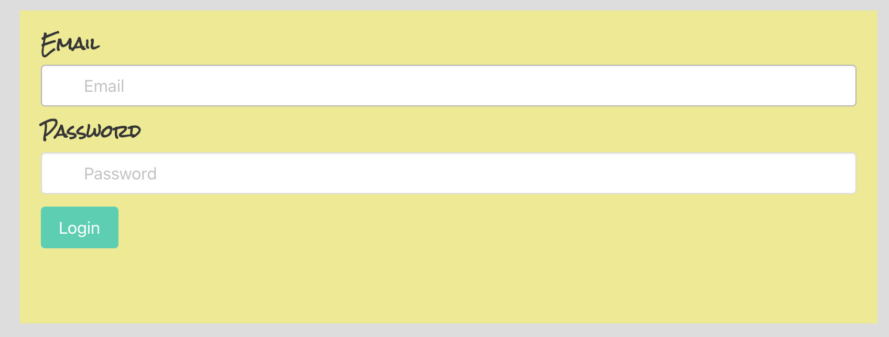
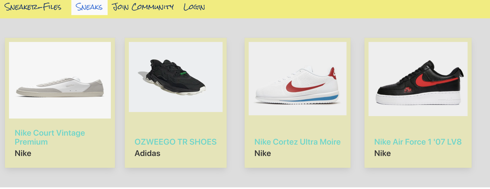
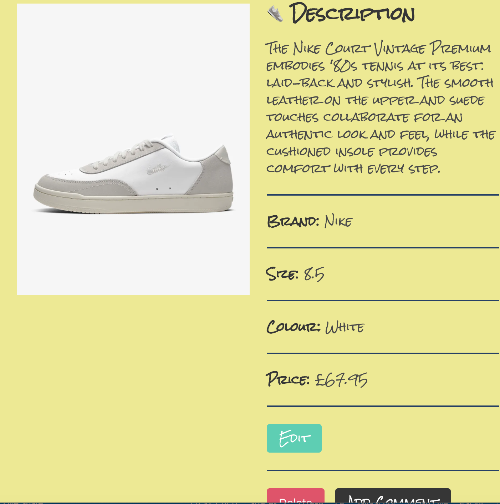

# SNEAKER-FILES - GA HOMEWORK/SIDE PROJECT

## Objective - 

To build a RESTful Express API app where users can upload and share their latest trainers with other users.

## Timeframe - 

3 days whilst learning how to build MERN stack apps. The objective was to take each thing learned from a particular day and implement it in the app.

## Technologies - React, Express, Node.js, JavaScript, MongoDB, Mongoose

## The Project:

### Day One -

* I started out by downloading express and mongoose using npm, before then connecting mongoose to my local server and creating my database in the index.js file.

* Once my I confirmed my server was working fine. I created the models folder which will house my trainers and user models. 

* I started off with my user model using the mongoose Schema class as below:
```
const userSchema = new Schema({
  username: { type: String, required: true, unique: true },
  email: { type: String, required: true, unique: true },
  password: { type: String, required: true }
})
```



The password confirmation was built using a .virtual method I had learnt in class earlier on that day and the 3rd party package bcrypt to encrypt the user password and then later compare it with the now hashed password to check for a match.

* The trainers model followed in a similar fashion but more straightforward without the need for any methods to generate virtual fields or 3rd party libraries. 
```
const trainerSchema = new mongoose.Schema({
  name: { type: String, required: true },
  brand: { type: String, required: true },
  color: { type: String, required: true },
  price: { type: Number, required: true },
  size: { type: Number, required: true, min: 1, max: 12 },
  image: { type: String, required: true },
  description: { type: String, required: true, maxlength: 300 },
  #### Added on day 2 comments: [commentSchema] // * Array of comments on trainer 
}, {
  timestamps: true
})
```



* Next step I took was setting up the controllers folder that will house my functions that perform the CRUD actions. 
  * I started off with the auth.js file where my asynchronous functions to create a user and login a user are. Once I wrote each function, I would then export out using modules.exports. Login also required the 3rd party package jsonwebtoken, to help allocate the user with an access token upon login
  * Once each function is exported, I then import the file that contains the functions, require the Router method from express and then setup the route point like so, for example:
   ### router.route('/trainers/:id')
* The trainers once again followed in a similar fashion, however, I was able to write functions to create a trainers, show all trainers, a single trainers, edit the trainers and delete the trainers as per the objective of the homework.
* Each function was tested using Insomnia to ensure I was getting back the correct json data.



### Day Two - 

* I added a comments field to the trainers model and then proceeded to the the comment post and delete functions in the trainers.js file in controllers. 
* Only logged in users can post a comment and only users who posted a particular comments can delete those comments. 
* The backend of my app is now built!! Time to move on to the frontend 
* I used the General Assembly template to create my frontend react app and then 3rd party package "http-proxy-middleware" to connect my backend to the frontend.
* Spent rest of day building frontend

### Day Three - 

* Building frontend

# Key Learnings - 

* MongoDB - How to create a database and connect to local server
* Creating models with mongoose
* Writing CRUD functions
* Connecting backend to frontend
* MongoDB folder structures

## Conclusion - 

My first real project where I actually started to feel like a developer. Thoroughly enjoyed it and have plans to work on it further in the future.


